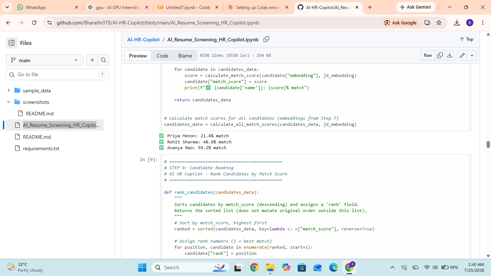
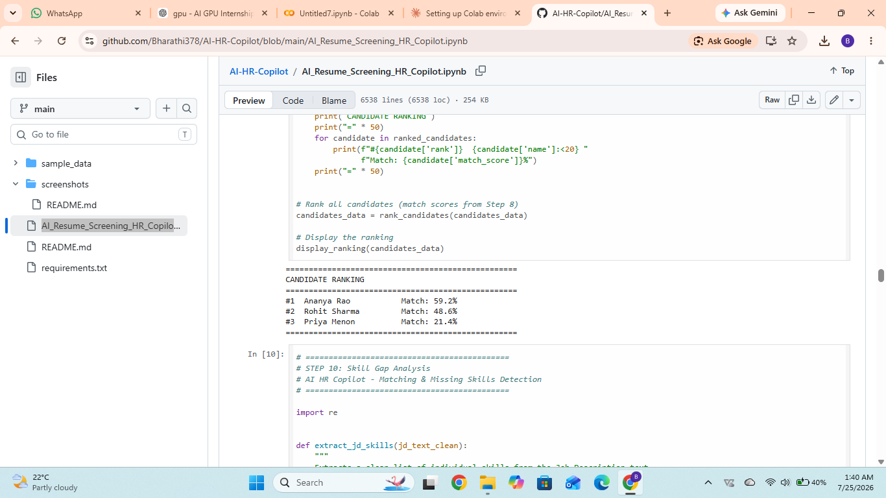
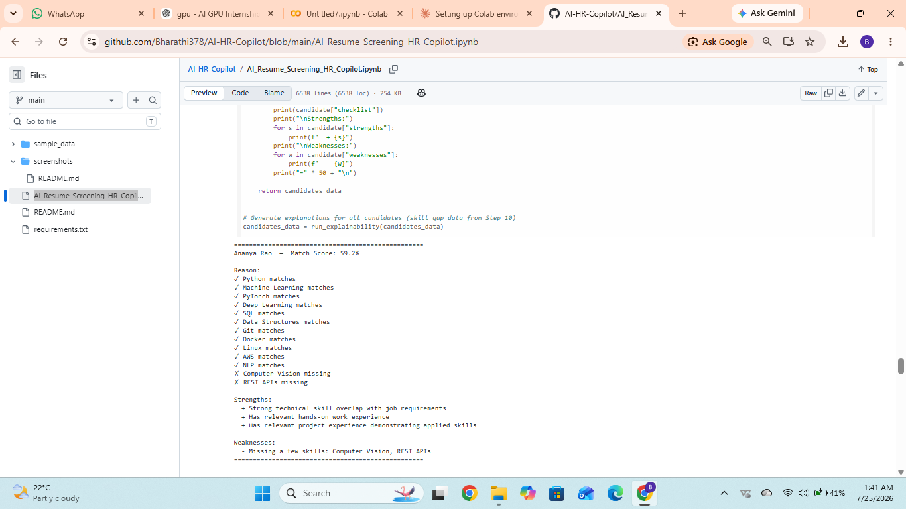
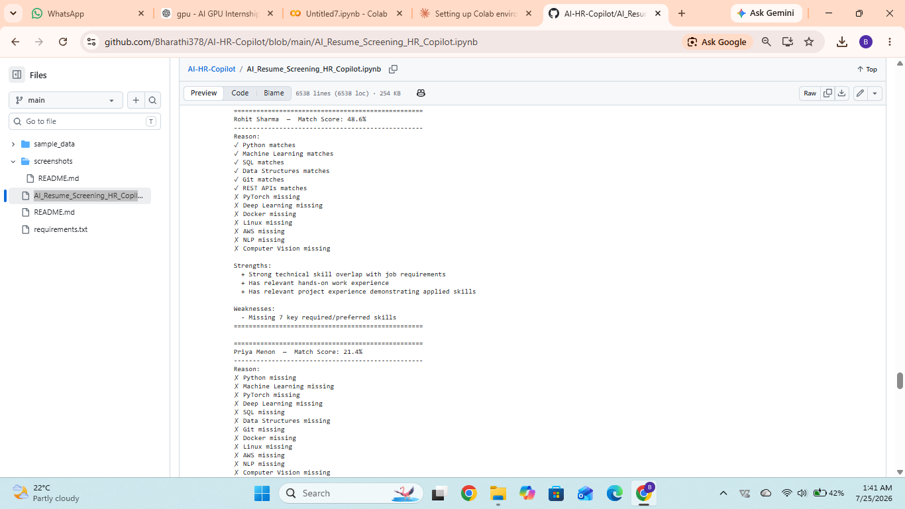
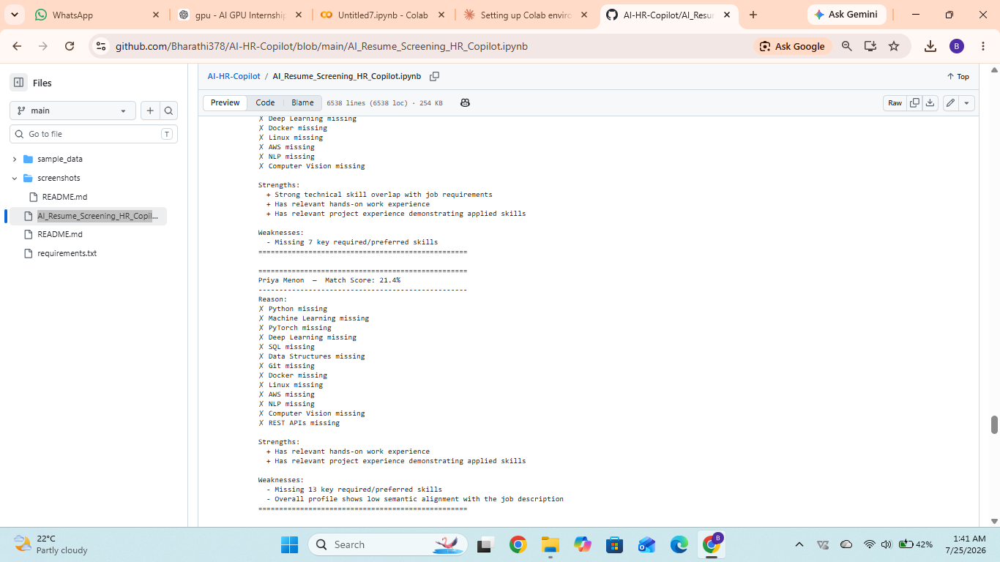
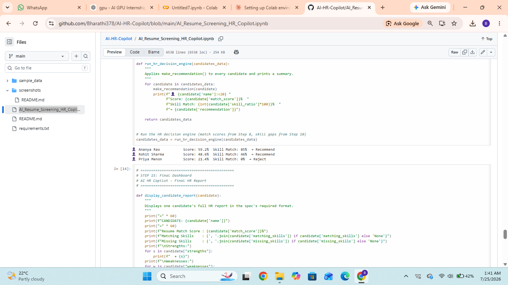
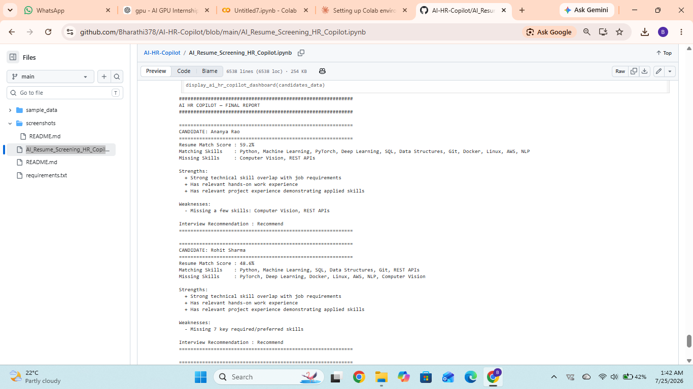

# AI HR Copilot

## Overview
AI HR Copilot is a Python-based application that helps recruiters automate resume screening. It compares candidate skills with job requirements, calculates a match score, ranks applicants, and provides interview recommendations, making the hiring process faster and more efficient.

## Features
- Resume analysis
- Job description matching
- Candidate ranking
- Match score calculation
- Skill gap analysis
- Interview recommendation
- HR summary dashboard

## Technologies Used
- Python
- Google Colab
- GitHub

## How It Works
1. Enter candidate information.
2. Compare candidate skills with job requirements.
3. Calculate a match percentage.
4. Identify strengths and missing skills.
5. Rank candidates.
6. Generate hiring recommendations.

## Future Improvements
- PDF resume parsing
- NLP-based resume analysis
- Machine Learning scoring
- Streamlit web application
- Database integration

## Author
**Bharathi M**

## 📸 Project Screenshots

### Match Score

### Candidate Ranking

### Skill Gap Analysis

### HR Recommendation

### Final Dashboard

### Final Ranking

